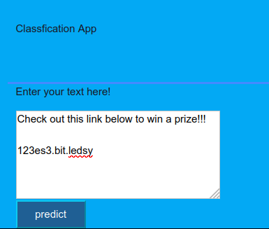
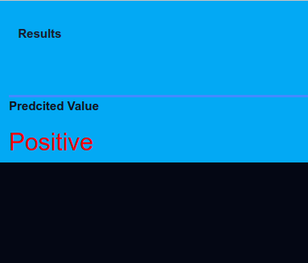

# Binary Classification of Texts

This is an example warmup for classifying text messages as spam or not-spam. This is a generic implementation that can be used as a benchmark and further development. The implementation includes some rough cleaning of the text and a Naive Bayes classifier. This is also further deployed using a Flask app.




## How to get started

<!--[Nothing here] -->

### Create Environmet

I used conda to create the environment in a unix environment.

```console
$ conda init
$ conda create -n ENV_NAME python=3.8.5
$ conda activate ENV_NAME
```

### Install requirements

Requirements are already put in a separate `requirements.txt` file. To install them run the following:

```console
$ pip install -r requirements.txt
```

To download spacy utilities for english language:
```console
$ python -m spacy download en_core_web_sm
```

## Running

<!--Instructions to run the code and create results-->

To train and create the models separately you should go to `src`:

To create the cross folds, run the following. This will create the dataframe with the fold number for testing.

```shell
$ python create_folds.py
```

To make the preprocessing required for training, run the following. This will create the `train.csv`

```shell
$ python preprocessing.py
```

To do the actual training, run:

```shell
$ python train.py
```

This will also saves the models and the vectorizers that could be loaded again.

## Project Content

Some 0of the important content of this project are illustrated below:

```console
.
├── clasifier_app
│   ├── app.py
│   ├── static
│   │   └── style.css
│   └── templates
│       ├── home.html
│       ├── layout.html
│       └── result.html
├── figs
├── input
│   ├── spam.csv
│   ├── spams_kfolds.csv
│   └── train.csv
├── models
│   ├── model_*.pkl
│   └── vectorizer_*.pkl
├── notebooks
│   └── exploration.ipynb
└── src
    ├── config.py
    ├── create_folds.py
    ├── preprocessing.py
    ├── train.py
    └── utils.py
├── README.md
├── requirements.txt

```

`./input/`

- contains the input files (raw and/or modified) used in the project

`./models/`

- contains the saved models and the saved vectorizers

`./notebooks/`

- contains the notebooks you may need to make exploration and/or for presentation purposes

`./src/`

- contains all the *.py codes used in the project

- `config.py`

  - consists of the environemtnal variables or global parameters used

- `create_folds.py`

  - creates the folds according to the data distribution for evaluation

- `preprocessing.py`

  - entails most of the preprocessing that goes into the raw data

- `train.py`

  - contains the tools to train the model

- `utils.py`

  - These are utility functions needed

`./requirements.txt`

- contains the libraries needed to be installed for running the programs smoothly

`./README.md`

- contains the instructions for running the programs smoothly

`clasifier_app`

- contains details for deploying the clasifier as an app on `Flask`

To run the Flask app in the local browser, go to the app folder.

```shell
$ export FLASK_APP=app.y
$ python app.y
```

Then open your browser at `localhost/5000`


### References:
The data is used from the the sms compilations at:

[http://www.dt.fee.unicamp.br/~tiago/smsspamcollection/]


Almeida, T.A., Gómez Hidalgo, J.M., Yamakami, A. Contributions to the Study of SMS Spam Filtering: New Collection and Results.  Proceedings of the 2011 ACM Symposium on Document Engineering (DOCENG'11), Mountain View, CA, USA, 2011.